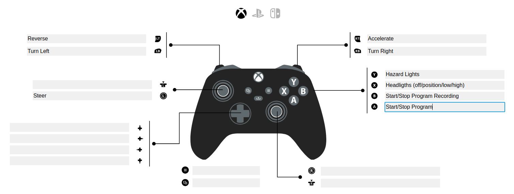
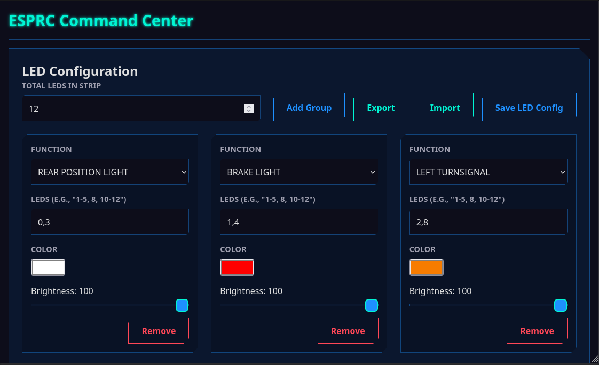

<div align="right">
<span><a href="README.md">Spanish</a> | English</span>
</div>

# 🚗 ESP-RC Brain: The Open Source Brain for Your RC Car

Welcome to the ESP-RC Brain repository! This project is the brain of a smart radio-controlled car, built on a powerful ESP32 microcontroller. Here you will find everything you need to bring your own vehicle to life: the firmware, the 3D models, and an incredible web application for you to take control from any browser.

This is not just an RC car, it is an open platform for you to experiment, learn and, above all, have a great time!

## 🎬 Project Gallery

### Videos

<p align="center">
<a href="https://www.youtube.com/watch?v=_Qa1ab6sNVU">

</a>
<a href="https://www.youtube.com/watch?v=7CDSC2cwirc">

</a>
</p>

### Images

<p align="center">
  
  
</p>
<p align="center">
  
  
</p>
<p align="center">
  
  
</p>
<p align="center">
  
  
</p>
<p align="center">
  
  
</p>

## ✨ Key Features

-   **Total and Flexible Control:**
    -   **Bluetooth:** Connect your favorite Bluetooth joystick or gamepad (PS3, PS4, PS5, Xbox, etc.) and drive with precision thanks to the [Bluepad32](https://github.com/ricardoquesada/bluepad32) library.
    -   **Wi-Fi:** Use the integrated web application to control every aspect of the car from your phone, tablet, or PC.

-   **Connectivity Modes:**
    -   **Access Point (AP):** The car creates its own Wi-Fi network for you to connect directly, ideal for use anywhere.
    -   **Client Mode:** Connect the car to your existing Wi-Fi network for greater convenience at home.

-   **Movement Programming:** Turn your car into a programmable robot!
    -   **Sequence Editor:** From the "Program" tab, you can create custom movement sequences. Add steps like "Forward," "Turn Right," or "Wait" and adjust the duration of each in milliseconds.
    -   **Kid's Programming Mode:** A visual and super-simplified interface where children can drag and drop command blocks (forward, backward, turn, honk) to create their own programs easily and intuitively.
    -   **Real-Time Recording and Playback:**
        -   **Record Maneuvers:** Press the record button in the interface and just drive. The system will log your every move, whether you use the virtual joysticks or a Bluetooth gamepad.
        -   **Indicator Light:** An LED on the car will flash red to indicate that recording is active.
        -   **Save and Execute:** Recorded programs and those created in the editor can be saved to the ESP32's memory, exported/imported as JSON files, and run whenever you want, specifying the number of repetitions or in an infinite loop.

-   **Comprehensive and Intuitive Web Application:**
    -   **Two Joystick Styles:** Choose between a unified joystick or two separate levers (tank style).
    -   **Real-Time Configuration:** Adjust the maximum speed, minimum starting speed, servo alignment, turning limits, and more—all from the browser and instantly!
    -   **Advanced LED Light Control:** Customize your car's lights (WS2812B). Create LED groups and assign them functions like position light, brake, reverse, turn signals, interior light, or underglow. The configuration can be imported and exported.
    -   **System Management:** Restart the ESP32 or restore factory settings with a single click.

-   **Robust and Open Firmware:** Written in C++ on the official Espressif framework (ESP-IDF), ensuring professional-level performance and stability.

## 📂 Project Structure

We have organized the repository logically so that you can find everything easily.

```
esprc-brain-c6/
├── Firmware/
│   ├── main/             # Main source code of the ESP32 (C++).
│   │   ├── src/          # .cpp files with the application logic.
│   │   └── include/      # .h header files.
│   │
│   ├── webapp/           # Source code of the web application (HTML, CSS, JS).
│   │
│   ├── components/       # Libraries and components of ESP-IDF (like Bluepad32).
│   └── build/            # Compilation folder (generated automatically).
│
├── Models/               # 3D models to print the car parts.
│   ├── SCADs/            # OpenSCAD source files (modifiable).
│   ├── STLs/             # STL files ready to print.
│   └── README.MD         # Instructions on the 3D models.
│
├── README.md             # You are here!
└── LICENSE               # The MIT license of this project.
```

## 🔩 3D Models

All the 3D models used to print the chassis and body of the car are in the `Models` folder. Inside it, you will find more detailed instructions in the `README.MD` file.

- **[See details of the 3D models](./Models/README.MD)**

## 🚀 First Steps

Ready to build? Here we explain how to get everything up and running.

### Prerequisites

1.  **Hardware:**
    - An ESP32 microcontroller (an ESP32 or an ESP32-C6 can be used).
    - WS2812 LEDs if you want to use the lights.
    - DC motor driver. Tested with L298N
    - DC motor/s (for acceleration)
    - Servo motor (for steering)
    - Power supply:
      - I am currently using 3 18650 batteries connected to a battery protector. And a Step-Down regulator to lower the voltage to 5v for the ESP32 and the Servo Motor.
2.  **Software:**
    -   [ESP-IDF](https://docs.espressif.com/projects/esp-idf/en/stable/esp32/get-started/index.html): The Espressif development environment.
    -   [Node.js and npm](https://nodejs.org/): To manage and compile the web application. (Only necessary if you want to modify the webapp)
    -   [Git](https://git-scm.com/): To clone the repository.

### Prepare the Firmware (ESP32)

1.  **Clone the repository:**
    It is very important to use the `--recursive` option to also download the necessary submodules (like Bluepad32).
    ```bash
    git clone --recursive https://gitlab.com/falmon/esprc-brain.git
    cd esprc-brain-c6/Firmware
    ```

2.  **Configure the project:**
    Open the ESP-IDF configuration menu to adjust specific parameters of your hardware if necessary.
    ```bash
    idf.py menuconfig
    ```

3.  **Compile the firmware:**
    This command will compile all the C++ code and prepare it to be transferred to the ESP32.
    ```bash
    idf.py build
    ```

4.  **Flash the ESP32:**
    Connect your ESP32 via USB and run the following command. Remember to change `/dev/ttyUSB0` to the corresponding serial port on your system.
    ```bash
    idf.py -p /dev/ttyUSB0 flash monitor
    ```
    This command flashes the firmware and opens a serial console so you can see the diagnostic messages in real time.

### WebApp Development (Optional)

If you want to modify the web interface, follow these steps. The webapp uses **Gulp.js** to package all the code (HTML, CSS, JS) into a single file that is integrated into the firmware.

1.  **Navigate to the webapp folder:**
    ```bash
    cd esprc-brain-c6/Firmware/webapp
    ```

2.  **Install the dependencies:**
    ```bash
    npm install
    ```

3.  **Useful commands:**
    -   `npm run build` or `gulp`: Compiles the webapp. This command packages and minifies the files from `src/` and copies the resulting `index.html` into the `Firmware/main/` folder, ready to be included in the firmware.
    -   `npm run serve`: Starts a local server to test the webapp in your browser without having to flash the ESP32.
    -   `npm run clean`: Deletes the files generated by the compilation.

> **Note:** After modifying the webapp and compiling it with `npm run build`, you must recompile and flash the ESP32 firmware for the changes to take effect on the car.

## 🔧 User Guide

### First Connection

By default, the ESP32 starts in **Access Point (AP) Mode**.

1.  **Connect to the Wi-Fi network:** On your phone or PC, look for a Wi-Fi network called **"ESP-RC-CAR"** and connect to it.
2.  **Open the web interface:** Open your browser and go to the address [http://ecar.local](http://ecar.local) or [http://192.168.4.1](http://192.168.4.1).
3.  **Let's drive!** You are now in the control interface. From the **"Connection"** tab, you can switch to Client mode so that the car connects to your local Wi-Fi network.

### Bluetooth Joystick Connection

1. Put the joystick in pairing mode
2. Make sure you have bluetooth enabled in the **Car Configuration** section
3. The ESP32 will automatically connect to the joystick

#### Layout
  

## Detailed Guide to the Web Interface

The web application gives you granular control over all the car's functions. It is divided into the following tabs:

  

### 🕹️ Joystick A
<table>
<tr>
<td width="25%" valign="top">

</td>
<td valign="top">
This mode presents a single virtual joystick for unified control of the vehicle.
<ul>
  <li><strong>Available controls:</strong>
    <ul>
      <li><strong>Joystick Location:</strong> You can change the position of the control on the screen for greater comfort.</li>
      <li><strong>Lights:</strong> Cycles through the headlight modes (off, position, low and high).</li>
      <li><strong>Turn signals:</strong> Activates the left and right turn signals.</li>
      <li><strong>Hazard lights:</strong> Activates the emergency lights.</li>
    </ul>
  </li>
</ul>
</td>
</tr>
</table>

### 🕹️🕹️ Joystick B
<table width="100%">
<tr>
<td width="40%" valign="top">

</td>
<td valign="top">
This mode offers two virtual joysticks for independent handling of acceleration and steering, similar to a tank.
<ul>
  <li><strong>Available controls:</strong>
    <ul>
      <li><strong>Steering Joystick:</strong> Controls the steering servo.</li>
      <li><strong>Acceleration Joystick:</strong> Controls the speed and direction of the motors.</li>
      <li><strong>Invert Joysticks:</strong> Swaps the position of the joysticks on the screen.</li>
      <li><strong>Light Controls:</strong> Identical to those of Joystick A (headlights, turn signals, hazard lights).</li>
    </ul>
  </li>
</ul>
</td>
</tr>
</table>

### 👨‍💻 Program
<table width="100%">
<tr>
<td width="40%" valign="top">
<!-- IMAGE FOR PROGRAM TAB -->

</td>
<td valign="top">
This tab turns the car into a programmable robot. Here you can create, save, and execute movement sequences.
<ul>
  <li><strong>Program Controls:</strong>
    <ul>
      <li><strong>Load/Upload:</strong> Load a program from the ESP32's memory or upload the one you've created to save it.</li>
      <li><strong>Export/Import:</strong> Save your program to a JSON file on your device or import one you already have.</li>
      <li><strong>Run/Stop:</strong> Start or stop the execution of the sequence.</li>
      <li><strong>Iterations:</strong> Define how many times the program will repeat, or check for an infinite loop.</li>
    </ul>
  </li>
  <li><strong>Action Sequence:</strong>
    <ul>
      <li><strong>Add Action:</strong> Adds a new step to the sequence.</li>
      <li><strong>Configure Action:</strong> For each step, you can choose a direction (forward, backward, etc.) and set a duration in milliseconds.</li>
      <li><strong>Order and Delete:</strong> Drag actions to change their order or delete them individually.</li>
    </ul>
  </li>
</ul>
</td>
</tr>
</table>

### 🧒 Kid Mode
<table width="100%">
<tr>
<td width="40%" valign="top">
<!-- IMAGE FOR KID MODE TAB -->

</td>
<td valign="top">
A simplified and visual interface designed for children to learn the basics of block programming.
<ul>
  <li><strong>Command Palette:</strong>
    <ul>
      <li><strong>Large Buttons:</strong> Instead of a complex editor, there are large buttons for each action (forward, turn, backward, honk, wait).</li>
      <li><strong>Sequence Building:</strong> Each time a command button is pressed, it is added to the visual sequence at the bottom.</li>
    </ul>
  </li>
  <li><strong>Sequence Execution:</strong>
    <ul>
      <li>The controls are simple: Run, Stop, and Clear All.</li>
      <li>It also allows setting the number of repetitions or an infinite loop, just like in the advanced mode.</li>
    </ul>
  </li>
</ul>
</td>
</tr>
</table>

### 📡 Connection
<table width="100%">
<tr>
<td width="40%" valign="top">

</td>
<td valign="top">
Here you can configure everything related to the connectivity of the ESP32.
<ul>
  <li><strong>Network Addresses:</strong>
    <ul>
      <li><strong>IP Address:</strong> Shows the current IP of the ESP32.</li>
      <li><strong>WebSocket URL:</strong> Address for real-time communication (movement control). You can change it for local development without having to save. Requires pressing `Reconnect Websocket`.</li>
      <li><strong>API URL:</strong> Address for commands and configurations. It can also be changed for local development.</li>
    </ul>
  </li>
  <li><strong>Wi-Fi Configuration:</strong>
    <ul>
      <li><strong>Wi-Fi Mode:</strong> Choose how the ESP32 connects.
        <ul>
          <li><strong>Access Point (AP):</strong> The ESP32 creates its own Wi-Fi network. Ideal for outdoor use.</li>
          <li><strong>Client:</strong> The ESP32 connects to an existing Wi-Fi network.</li>
        </ul>
      </li>
    </ul>
  </li>
  <li><strong>Actions:</strong>
    <ul>
      <li><strong>Update:</strong> Gets the current configuration from the ESP32.</li>
      <li><strong>Save:</strong> Stores the configuration changes in the ESP32.</li>
      <li><strong>Reconnect Websocket:</strong> Restarts the real-time control connection.</li>
    </ul>
  </li>
</ul>
</td>
</tr>
</table>

### 🚗 Car Configuration
<table width="100%">
<tr>
<td width="40%" valign="top">

</td>
<td valign="top">
In this section, the physical parameters of the car are adjusted.
<ul>
  <li><strong>Acceleration Settings:</strong>
    <ul>
      <li><strong>Maximum Speed:</strong> Limits the maximum power of the DC motors.</li>
      <li><strong>Minimum Speed:</strong> Defines the minimum power for the motors to start moving.</li>
    </ul>
  </li>
  <li><strong>Steering Settings:</strong>
    <ul>
      <li><strong>Alignment:</strong> Calibrates the center point of the steering servo.</li>
      <li><strong>Left Turn Limit:</strong> Sets the maximum turning angle to the left.</li>
      <li><strong>Right Turn Limit:</strong> Sets the maximum turning angle to the right.</li>
    </ul>
  </li>
  <li><strong>Automatic Turn Signal Settings:</strong>
    <ul>
      <li><strong>Enable Automatic Turn Signals:</strong> Activates automatic turn signals.</li>
      <li><strong>Automatic Turn Signal Threshold:</strong> Threshold for turn signal activation.</li>
    </ul>
  </li>
  <li><strong>Bluetooth:</strong>
    <ul>
      <li><strong>Enable Bluetooth:</strong> Activates pairing mode to connect a new joystick.</li>
      <li><strong>Attention!</strong> Bluetooth is disabled by default when starting in AP mode to avoid conflicts.</li>
    </ul>
  </li>
</ul>
</td>
</tr>
</table>

### 💡 LED Configuration
<table width="100%">
<tr>
<td width="40%" valign="top">

</td>
<td valign="top">
Customize your car's lighting system. Addressable LEDs (WS2812B type) are required.
<ul>
  <li><strong>LED Definition:</strong>
    <ul>
      <li>First, specify the <strong>total number of LEDs</strong> connected in series.</li>
      <li>Then, create <strong>LED groups</strong> by assigning them a function. You can define the LEDs of a group with numbers separated by commas (eg: `0,1,5`) or ranges (eg: `6-9`), or a combination (eg: `0,6-7,9-10,12`).</li>
    </ul>
  </li>
  <li><strong>Group Functions:</strong>
  For each group, you can define the function, color and brightness.
    <ul>
      <li>`FRONT POSITION LIGHT`: Front headlights.</li>
      <li>`REAR POSITION LIGHT`: Rear headlights.</li>
      <li>`BRAKE LIGHT`</li>
      <li>`REVERSE LIGHT`</li>
      <li>`LEFT TURN SIGNAL`</li>
      <li>`RIGHT TURN SIGNAL`</li>
      <li>`INTERIOR LIGHT`</li>
      <li>`UNDERGLOW` (Neon effect)</li>
    </ul>
  </li>
  <li><strong>Current Behavior:</strong>
    <ul>
      <li>The position, interior and underglow lights are activated with the headlight button and have 3 intensity levels.</li>
      <li>The turn signals are activated both when turning and with the hazard lights.</li>
      <li>The reverse light is not yet implemented.</li>
    </ul>
  </li>
</ul>
</td>
</tr>
</table>

### ⚙️ ESP32 Administration
<table width="100%">
<tr>
<td width="25%" valign="top">

</td>
<td valign="top">
Microcontroller maintenance tasks.
<ul>
  <li><strong>Restart ESP32:</strong> Performs a software reset.</li>
  <li><strong>Clear Configuration (Hard Reset):</strong> Deletes all saved settings and restores them to their default values.</li>
</ul>
</td>
</tr>
</table>

### 🔧 Settings
<table width="100%">
<tr>
<td width="25%" valign="top">

</td>
<td valign="top">
Settings specific to the web application.
<ul>
  <li><strong>Language:</strong> Change the interface language.</li>
  <li><strong>Appearance:</strong> Choose between light and dark mode.</li>
</ul>
</td>
</tr>
</table>

## 🤝 Want to Contribute?

Contributions are the engine of open source and are more than welcome! If you have an idea, have found a bug or want to add a new feature, follow these steps:

1.  **Fork** this repository.
2.  Create a new branch for your feature (`git checkout -b feature/my-cool-idea`).
3.  Make your changes and commit (`git commit -m 'Add a new cool idea'`).
4.  Push your branch to your fork (`git push origin feature/my-cool-idea`).
5.  Open a **Pull Request** so we can review your contribution.

## 📝 To-Do List

-   [ ] Add a schematic of the electronic circuit.
-   [ ] Function to export and import the complete car configuration.

## 🙏 Acknowledgments

-   **[Duke Doks](https://dukedoks.com/):** For creating and sharing the incredible 3D models of the [chassis](https://dukedoks.com/portfolio/guia-chasis-rc/) and the [body](https://dukedoks.com/portfolio/guia-delorean-bttf/).
-   **[Ricardo Quesada](https://github.com/ricardoquesada):** For developing the fantastic [Bluepad32](https://github.com/ricardoquesada/bluepad32) library.
-   **[Benoît Blanchon](https://github.com/bblanchon):** For the indispensable [ArduinoJson](https://github.com/bblanchon/ArduinoJson) library.

## 📜 License

This project is distributed under the **MIT License**. This means that you are free to use, modify and distribute the code as you wish, as long as you keep the original copyright notice.

> **Important:** Bluepad32 depends on the [BTstack](https://github.com/bluekitchen/btstack) library, which is free for open source projects but requires a commercial license for closed source projects.

---
Made with ❤️, ☕ and many cables by [Facundo Almon](https://github.com/facundoAlmon).