<div align="right">
<span>Español | <a href="README.en.md">English</a></span>
</div>

# 🚗 ESP-RC Brain: El Cerebro de Código Abierto para tu Coche RC

¡Te damos la bienvenida al repositorio de ESP-RC Brain! Este proyecto es el cerebro de un coche a radiocontrol inteligente, construido sobre un potente microcontrolador ESP32. Aquí encontrarás todo lo necesario para dar vida a tu propio vehículo: el firmware, los modelos 3D y una increíble aplicación web para que tomes el control desde cualquier navegador.

Este no es solo un coche a RC, es una plataforma abierta para que puedas experimentar, aprender y, sobre todo, ¡divertirte a lo grande!

## 🎬 Galería del Proyecto

### Videos

<p align="center">
<a href="https://www.youtube.com/watch?v=_Qa1ab6sNVU">

</a>
<a href="https://www.youtube.com/watch?v=7CDSC2cwirc">

</a>
</p>

### Imágenes

<p align="center">
  
  
</p>
<p align="center">
  
  
</p>
<p align="center">
  
  
</p>
<p align="center">
  
  
</p>
<p align="center">
  
  
</p>

## ✨ Características Principales

-   **Control Total y Flexible:**
    -   **Bluetooth:** Conecta tu joystick o gamepad Bluetooth favorito (PS3, PS4, PS5, Xbox, etc.) y conduce con precisión gracias a la librería [Bluepad32](https://github.com/ricardoquesada/bluepad32).
    -   **Wi-Fi:** Usa la aplicación web integrada para controlar cada aspecto del coche desde tu teléfono, tablet o PC.

-   **Modos de Conectividad:**
    -   **Access Point (AP):** El coche crea su propia red Wi-Fi para que te conectes directamente, ideal para usarlo en cualquier lugar.
    -   **Modo Cliente:** Conecta el coche a tu red Wi-Fi existente para mayor comodidad en casa.

-   **Programación de Movimientos:** ¡Convierte tu coche en un robot programable!
    -   **Editor de Secuencias:** Desde la pestaña "Programa", puedes crear secuencias de movimiento personalizadas. Añade pasos como "Avanzar", "Girar a la Derecha" o "Esperar" y ajusta la duración de cada uno en milisegundos.
    -   **Modo de Programación para Niños:** Una interfaz visual y súper simplificada donde los niños pueden arrastrar y soltar bloques de comandos (avanzar, retroceder, girar, tocar la bocina) para crear sus propios programas de forma fácil e intuitiva.
    -   **Grabación y Reproducción en Tiempo Real:**
        -   **Graba Maniobras:** Pulsa el botón de grabar en la interfaz y simplemente conduce. El sistema registrará cada uno de tus movimientos, ya sea que uses los joysticks virtuales o un gamepad Bluetooth.
        -   **Luz Indicadora:** Un LED en el coche parpadeará en rojo para indicar que la grabación está activa.
        -   **Guarda y Ejecuta:** Los programas grabados y los creados en el editor se pueden guardar en la memoria del ESP32, exportar/importar como archivos JSON, y ejecutar cuando quieras, especificando el número de repeticiones o en bucle infinito.

-   **Aplicación Web Completa e Intuitiva:**
    -   **Dos Estilos de Joystick:** Elige entre un joystick unificado o dos palancas separadas (estilo tanque).
    -   **Configuración en Tiempo Real:** Ajusta la velocidad máxima, la velocidad mínima de arranque, la alineación del servo, los límites de giro y más, ¡todo desde el navegador y al instante!
    -   **Control Avanzado de Luces LED:** Personaliza las luces de tu coche (WS2812B). Crea grupos de LEDs y asígnales funciones como luz de posición, freno, marcha atrás, intermitentes, luz de interior o neón (Underglow). La configuración se puede importar y exportar.
    -   **Gestión del Sistema:** Reinicia el ESP32 o restaura la configuración de fábrica con un solo clic.

-   **Firmware Robusto y Abierto:** Escrito en C++ sobre el framework oficial de Espressif (ESP-IDF), garantizando un rendimiento y estabilidad de nivel profesional.

## 📂 Estructura del Proyecto

Hemos organizado el repositorio de forma lógica para que encuentres todo fácilmente.

```
esprc-brain-c6/
├── Firmware/
│   ├── main/             # Código fuente principal del ESP32 (C++).
│   │   ├── src/          # Archivos .cpp con la lógica de la aplicación.
│   │   └── include/      # Archivos de cabecera .h.
│   │
│   ├── webapp/           # Código fuente de la aplicación web (HTML, CSS, JS).
│   │
│   ├── components/       # Librerías y componentes de ESP-IDF (como Bluepad32).
│   └── build/            # Carpeta de compilación (generada automáticamente).
│
├── Models/               # Modelos 3D para imprimir las piezas del coche.
│   ├── SCADs/            # Archivos fuente de OpenSCAD (modificables).
│   ├── STLs/             # Archivos STL listos para imprimir.
│   └── README.MD         # Instrucciones sobre los modelos 3D.
│
├── README.md             # ¡Estás aquí!
└── LICENSE               # La licencia MIT de este proyecto.
```

## 🔩 Modelos 3D

Todos los modelos 3D utilizados para imprimir el chasis y la carrocería del coche se encuentran en la carpeta `Models`. Dentro de ella, encontrarás instrucciones más detalladas en el archivo `README.MD`.

- **[Ver detalles de los modelos 3D](./Models/README.MD)**

## 🚀 Primeros Pasos

¿Listo para construir? Aquí te explicamos cómo poner todo en marcha.

### Requisitos Previos

1.  **Hardware:** 
    - Un microcontrolador ESP32 (Se puede utilizar un ESP32 o un ESP32-C6).
    - LEDs WS2812 si se quieren usar las luces.
    - Driver de motor DC. Probado con L298N
    - Motor/es DC (para la aceleracion)
    - Motor Servo (para la direccion)
    - Alimentacion:
      - Actualmente estoy usando 3 baterias 18650 conectadas a un protector de bateria. Y un regulador Step-Down para bajar la tension a 5v para el ESP32 y el Motor Servo.
2.  **Software:**
    -   [ESP-IDF](https://docs.espressif.com/projects/esp-idf/en/stable/esp32/get-started/index.html): El entorno de desarrollo de Espressif.
    -   [Node.js y npm](https://nodejs.org/): Para gestionar y compilar la aplicación web. (Solo necesario si se quiere modificar la webapp)
    -   [Git](https://git-scm.com/): Para clonar el repositorio.

### Preparar el Firmware (ESP32)

1.  **Clona el repositorio:**
    Es muy importante usar la opción `--recursive` para descargar también los submódulos necesarios (como Bluepad32).
    ```bash
    git clone --recursive https://gitlab.com/falmon/esprc-brain.git
    cd esprc-brain-c6/Firmware
    ```

2.  **Configura el proyecto:**
    Abre el menú de configuración de ESP-IDF para ajustar parámetros específicos de tu hardware si fuera necesario.
    ```bash
    idf.py menuconfig
    ```

3.  **Compila el firmware:**
    Este comando compilará todo el código C++ y lo preparará para ser transferido al ESP32.
    ```bash
    idf.py build
    ```

4.  **Flashea el ESP32:**
    Conecta tu ESP32 por USB y ejecuta el siguiente comando. Recuerda cambiar `/dev/ttyUSB0` por el puerto serie que corresponda en tu sistema.
    ```bash
    idf.py -p /dev/ttyUSB0 flash monitor
    ```
    Este comando flashea el firmware y abre una consola serie para que veas los mensajes de diagnóstico en tiempo real.

### Desarrollo de la WebApp (Opcional)

Si quieres modificar la interfaz web, sigue estos pasos. La webapp usa **Gulp.js** para empaquetar todo el código (HTML, CSS, JS) en un único archivo que se integra en el firmware.

1.  **Navega a la carpeta de la webapp:**
    ```bash
    cd esprc-brain-c6/Firmware/webapp
    ```

2.  **Instala las dependencias:**
    ```bash
    npm install
    ```

3.  **Comandos útiles:**
    -   `npm run build` o `gulp`: Compila la webapp. Este comando empaqueta y minifica los archivos de `src/` y copia el `index.html` resultante en la carpeta `Firmware/main/`, listo para ser incluido en el firmware.
    -   `npm run serve`: Inicia un servidor local para probar la webapp en tu navegador sin necesidad de flashear el ESP32.
    -   `npm run clean`: Borra los archivos generados por la compilación.

> **Nota:** Después de modificar la webapp y compilarla con `npm run build`, debes volver a compilar y flashear el firmware del ESP32 para que los cambios surtan efecto en el coche.

## 🔧 Guía de Uso

### Primera Conexión

Por defecto, el ESP32 se inicia en **Modo Access Point (AP)**.

1.  **Conéctate a la red Wi-Fi:** En tu teléfono o PC, busca una red Wi-Fi llamada **"ESP-RC-CAR"** y conéctate a ella.
2.  **Abre la interfaz web:** Abre tu navegador y ve a la dirección [http://ecar.local](http://ecar.local) o [http://192.168.4.1](http://192.168.4.1).
3.  **¡A conducir!** Ya estás en la interfaz de control. Desde la pestaña **"Conexión"**, puedes cambiar al modo Cliente para que el coche se conecte a tu red Wi-Fi local.

### Conexion de Joystick Bluetooth

1. Poner el joystick en modo pairing
2. Asegurarse de tener el bluetooth activado en la seccion de **Configuración del Auto**
3. El ESP32 se conectara automaticamente al joystick

#### Layout
  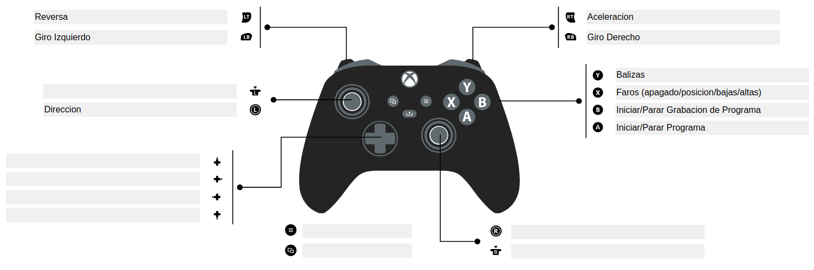

## Guía Detallada de la Interfaz Web

La aplicación web te da un control granular sobre todas las funciones del coche. Se divide en las siguientes pestañas:

  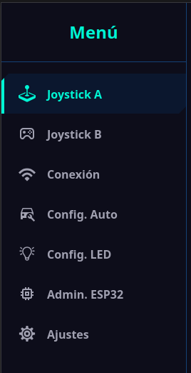

### 🕹️ Joystick A
<table>
<tr>
<td width="25%" valign="top">
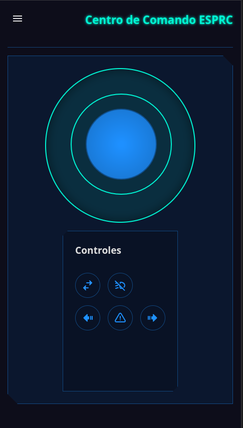
</td>
<td valign="top">
Este modo presenta un solo joystick virtual para un control unificado del vehículo.
<ul>
  <li><strong>Controles disponibles:</strong>
    <ul>
      <li><strong>Ubicación del Joystick:</strong> Puedes cambiar la posición del control en la pantalla para mayor comodidad.</li>
      <li><strong>Luces:</strong> Cicla entre los modos de faros (apagado, posición, bajas y altas).</li>
      <li><strong>Intermitentes:</strong> Activa las luces de giro izquierda y derecha.</li>
      <li><strong>Balizas:</strong> Activa las luces de emergencia.</li>
      <li><strong>Grabar:</strong> Comienza la grabacion (Los leds del grupo "LUZ GRABACION" parpadean cuando la grabacion esta activa).</li>
    </ul>
  </li>
</ul>
</td>
</tr>
</table>

### 🕹️🕹️ Joystick B
<table width="100%">
<tr>
<td width="40%" valign="top">
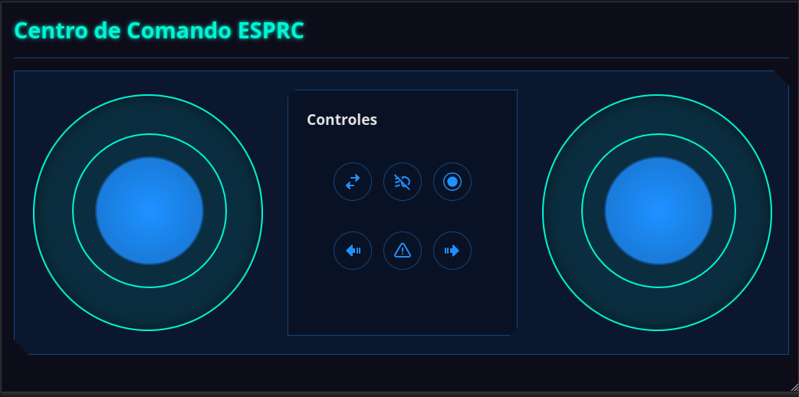
</td>
<td valign="top">
Este modo ofrece dos joysticks virtuales para un manejo independiente de la aceleración y la dirección, similar a un tanque.
<ul>
  <li><strong>Controles disponibles:</strong>
    <ul>
      <li><strong>Joystick de Dirección:</strong> Controla el servo de giro.</li>
      <li><strong>Joystick de Aceleración:</strong> Controla la velocidad y el sentido de los motores.</li>
      <li><strong>Invertir Joysticks:</strong> Intercambia la posición de los joysticks en pantalla.</li>
      <li><strong>Controles de Luces:</strong> Idénticos a los del Joystick A (faros, intermitentes, balizas).</li>
      <li><strong>Grabar:</strong> Comienza la grabacion (Los leds del grupo "LUZ GRABACION" parpadean cuando la grabacion esta activa).</li>
    </ul>
  </li>
</ul>
</td>
</tr>
</table>

### 👨‍💻 Programa
<table width="100%">
<tr>
<td width="40%" valign="top">
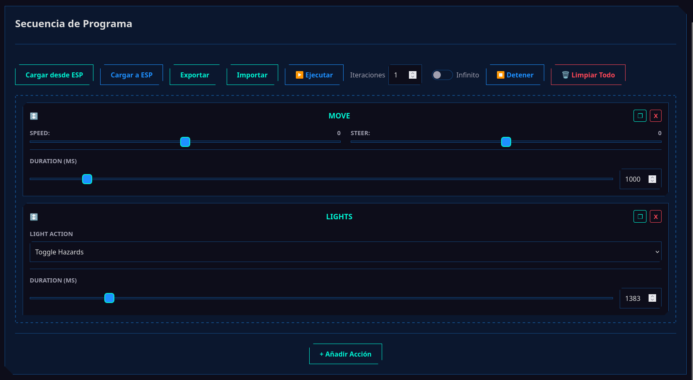
</td>
<td valign="top">
Esta pestaña convierte el coche en un robot programable. Aquí puedes crear, guardar y ejecutar secuencias de movimientos.
<ul>
  <li><strong>Controles del Programa:</strong>
    <ul>
      <li><strong>Cargar/Subir:</strong> Carga un programa desde la memoria del ESP32 o sube el que has creado para guardarlo.</li>
      <li><strong>Exportar/Importar:</strong> Guarda tu programa en un archivo JSON en tu dispositivo o importa uno que ya tengas.</li>
      <li><strong>Ejecutar/Detener:</strong> Inicia o para la ejecución de la secuencia.</li>
      <li><strong>Iteraciones:</strong> Define cuántas veces se repetirá el programa, o márcalo como infinito.</li>
    </ul>
  </li>
  <li><strong>Secuencia de Acciones:</strong>
    <ul>
      <li><strong>Añadir Acción:</strong> Agrega un nuevo paso a la secuencia.</li>
      <li><strong>Configurar Acción:</strong> Para cada paso, puedes elegir una dirección (avanzar, retroceder, etc.) y establecer una duración en milisegundos.</li>
      <li><strong>Ordenar y Eliminar:</strong> Arrastra las acciones para cambiar su orden o elimínalas individualmente.</li>
    </ul>
  </li>
</ul>
</td>
</tr>
</table>

### 🧒 Modo Niños
<table width="100%">
<tr>
<td width="40%" valign="top">
<!-- IMAGEN DE LA PESTAÑA MODO NIÑOS -->
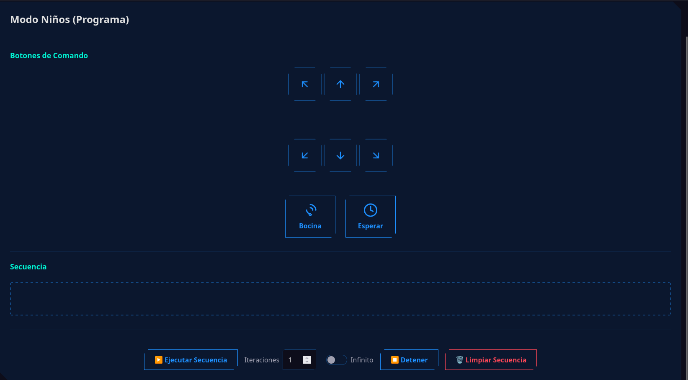
</td>
<td valign="top">
Una interfaz simplificada y visual diseñada para que los niños aprendan los fundamentos de la programación por bloques.
<ul>
  <li><strong>Paleta de Comandos:</strong>
    <ul>
      <li><strong>Botones Grandes:</strong> En lugar de un editor complejo, hay botones grandes para cada acción (avanzar, girar, retroceder, tocar bocina, esperar).</li>
      <li><strong>Construcción de Secuencia:</strong> Cada vez que se presiona un botón de comando, este se añade a la secuencia visual en la parte inferior.</li>
    </ul>
  </li>
  <li><strong>Ejecución de la Secuencia:</strong>
    <ul>
      <li>Los controles son sencillos: Ejecutar, Detener y Limpiar todo.</li>
      <li>También permite definir el número de repeticiones o un bucle infinito, igual que en el modo avanzado.</li>
    </ul>
  </li>
</ul>
</td>
</tr>
</table>

### 📡 Conexión
<table width="100%">
<tr>
<td width="40%" valign="top">
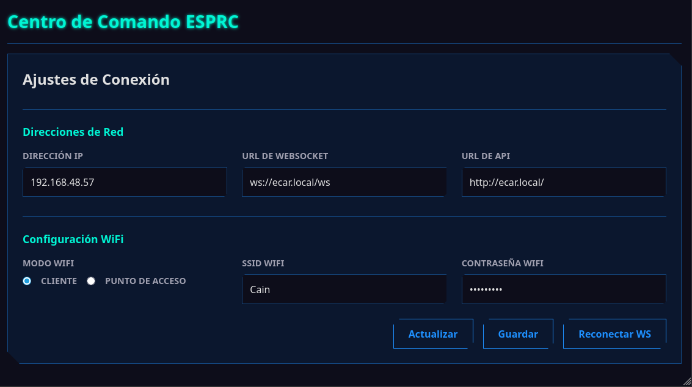
</td>
<td valign="top">
Aquí puedes configurar todo lo relacionado con la conectividad del ESP32.
<ul>
  <li><strong>Direcciones de Red:</strong>
    <ul>
      <li><strong>Dirección IP:</strong> Muestra la IP actual del ESP32.</li>
      <li><strong>URL de WebSocket:</strong> Dirección para la comunicación en tiempo real (control de movimiento). Puedes cambiarla para desarrollo local sin necesidad de guardar. Requiere pulsar `Reconectar Websocket`.</li>
      <li><strong>URL de API:</strong> Dirección para comandos y configuraciones. También se puede cambiar para desarrollo local.</li>
    </ul>
  </li>
  <li><strong>Configuración Wi-Fi:</strong>
    <ul>
      <li><strong>Modo Wi-Fi:</strong> Elige cómo se conecta el ESP32.
        <ul>
          <li><strong>Punto de Acceso (AP):</strong> El ESP32 crea su propia red Wi-Fi. Ideal para uso en exteriores.</li>
          <li><strong>Cliente:</strong> El ESP32 se conecta a una red Wi-Fi existente.</li>
        </ul>
      </li>
    </ul>
  </li>
  <li><strong>Acciones:</strong>
    <ul>
      <li><strong>Actualizar:</strong> Obtiene la configuración actual desde el ESP32.</li>
      <li><strong>Guardar:</strong> Almacena los cambios de configuración en el ESP32.</li>
      <li><strong>Reconectar Websocket:</strong> Reinicia la conexión de control en tiempo real.</li>
    </ul>
  </li>
</ul>
</td>
</tr>
</table>

### 🚗 Configuración del Auto
<table width="100%">
<tr>
<td width="40%" valign="top">
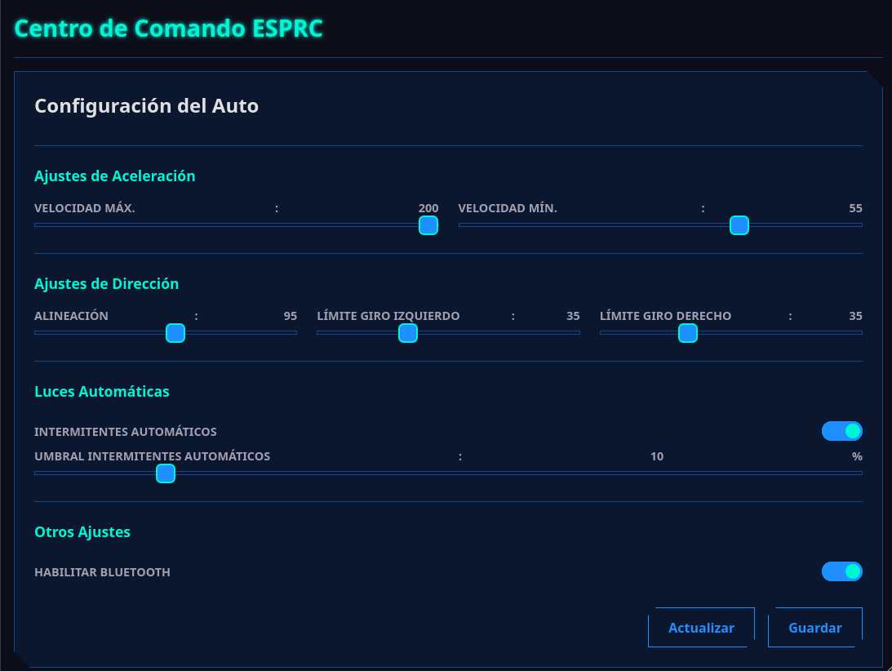
</td>
<td valign="top">
En esta sección se ajustan los parámetros físicos del coche.
<ul>
  <li><strong>Ajustes de Aceleración:</strong>
    <ul>
      <li><strong>Velocidad Máxima:</strong> Limita la potencia máxima de los motores DC.</li>
      <li><strong>Velocidad Mínima:</strong> Define la potencia mínima para que los motores empiecen a moverse.</li>
    </ul>
  </li>
  <li><strong>Ajustes de Dirección:</strong>
    <ul>
      <li><strong>Alineación:</strong> Calibra el punto central del servo de dirección.</li>
      <li><strong>Límite Giro Izquierdo:</strong> Establece el ángulo máximo de giro a la izquierda.</li>
      <li><strong>Límite Giro Derecho:</strong> Establece el ángulo máximo de giro a la derecha.</li>
    </ul>
  </li>
  <li><strong>Ajustes de Luces Automáticas:</strong>
    <ul>
      <li><strong>Activar Intermitentes Automáticos:</strong> Activa luces de giro automaticas.</li>
      <li><strong>Umbral Intermitentes Automáticos:</strong> Umbral para activacion de luces de giro.</li>
    </ul>
  </li>
  <li><strong>Bluetooth:</strong>
    <ul>
      <li><strong>Habilitar Bluetooth:</strong> Activa el modo de emparejamiento para conectar un nuevo joystick.</li>
      <li><strong>¡Atención!</strong> El Bluetooth se deshabilita por defecto al iniciar en modo AP para evitar conflictos.</li>
    </ul>
  </li>
</ul>
</td>
</tr>
</table>

### 💡 Configuración LED
<table width="100%">
<tr>
<td width="40%" valign="top">
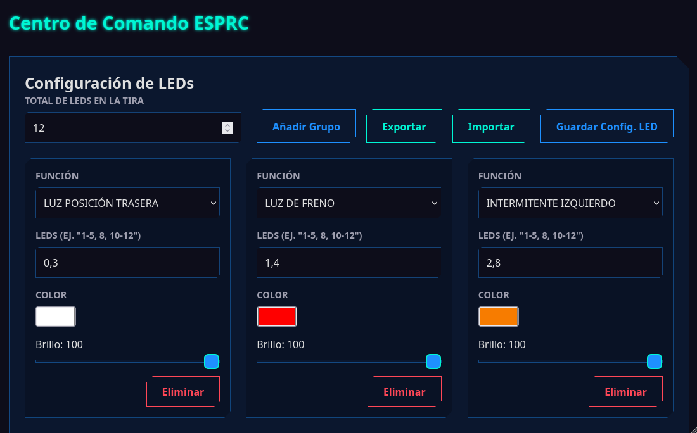
</td>
<td valign="top">
Personaliza el sistema de iluminación de tu coche. Se requieren LEDs direccionables (tipo WS2812B).
<ul>
  <li><strong>Definición de LEDs:</strong>
    <ul>
      <li>Primero, especifica la <strong>cantidad total de LEDs</strong> conectados en serie.</li>
      <li>Luego, crea <strong>grupos de LEDs</strong> asignándoles una función. Puedes definir los LEDs de un grupo con números separados por comas (ej: `0,1,5`) o rangos (ej: `6-9`), o una combinación (ej: `0,6-7,9-10,12`).</li>
    </ul>
  </li>
  <li><strong>Funciones de los Grupos:</strong>
  Para cada grupo, puedes definir la función, el color y el brillo.
    <ul>
      <li>`LUZ POSICION FRONTAL`: Faros delanteros.</li>
      <li>`LUZ POSICION TRASERA`: Faros traseros.</li>
      <li>`LUZ DE FRENO`</li>
      <li>`LUZ DE MARCHA ATRAS`</li>
      <li>`INTERMITENTE IZQUIERDO`</li>
      <li>`INTERMITENTE DERECHO`</li>
      <li>`LUZ INTERIOR`</li>
      <li>`LUZ BAJOS` (Efecto neón)</li>
      <li>`LUZ GRABACION`</li>
    </ul>
  </li>
  <li><strong>Comportamiento Actual:</strong>
    <ul>
      <li>Las luces de posición, interior y bajos se activan con el botón de faros y tienen 3 niveles de intensidad.</li>
      <li>Los intermitentes se activan tanto al girar como con las balizas.</li>
      <li>La luz de marcha atrás aún no está implementada.</li>
    </ul>
  </li>
</ul>
</td>
</tr>
</table>

### ⚙️ Administración ESP32
<table width="100%">
<tr>
<td width="25%" valign="top">
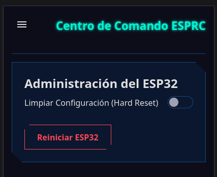
</td>
<td valign="top">
Tareas de mantenimiento del microcontrolador.
<ul>
  <li><strong>Reiniciar ESP32:</strong> Realiza un reinicio por software.</li>
  <li><strong>Limpiar Configuración (Hard Reset):</strong> Borra toda la configuración guardada y la restaura a los valores por defecto.</li>
</ul>
</td>
</tr>
</table>

### 🔧 Ajustes
<table width="100%">
<tr>
<td width="25%" valign="top">
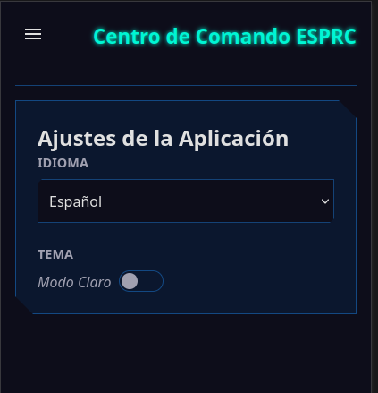
</td>
<td valign="top">
Configuraciones propias de la aplicación web.
<ul>
  <li><strong>Idioma:</strong> Cambia el idioma de la interfaz.</li>
  <li><strong>Apariencia:</strong> Elige entre el modo claro y el modo oscuro.</li>
</ul>
</td>
</tr>
</table>

## 🤝 ¿Quieres Contribuir?

¡Las contribuciones son el motor del código abierto y son más que bienvenidas! Si tienes una idea, has encontrado un error o quieres añadir una nueva funcionalidad, sigue estos pasos:

1.  Haz un **Fork** de este repositorio.
2.  Crea una nueva rama para tu funcionalidad (`git checkout -b feature/mi-idea-genial`).
3.  Realiza tus cambios y haz commit (`git commit -m 'Añado una nueva idea genial'`).
4.  Sube tu rama a tu fork (`git push origin feature/mi-idea-genial`).
5.  Abre un **Pull Request** para que podamos revisar tu aportación.

## 📝 Tareas Pendientes (ToDo)

-   [ ] Agregar un esquema del circuito electrónico.
-   [ ] Función para exportar e importar la configuración completa del coche.


## 🙏 Agradecimientos

-   **[Duke Doks](https://dukedoks.com/):** Por crear y compartir los increíbles modelos 3D del [chasis](https://dukedoks.com/portfolio/guia-chasis-rc/) y la [carrocería](https://dukedoks.com/portfolio/guia-delorean-bttf/).
-   **[Ricardo Quesada](https://github.com/ricardoquesada):** Por desarrollar la fantástica librería [Bluepad32](https://github.com/ricardoquesada/bluepad32).
-   **[Benoît Blanchon](https://github.com/bblanchon):** Por la indispensable librería [ArduinoJson](https://github.com/bblanchon/ArduinoJson).

## 📜 Licencia

Este proyecto está distribuido bajo la **Licencia MIT**. Esto significa que eres libre de usar, modificar y distribuir el código como quieras, siempre que mantengas el aviso de copyright original.

> **Importante:** Bluepad32 depende de la librería [BTstack](https://github.com/bluekitchen/btstack), que es gratuita para proyectos de código abierto pero requiere una licencia comercial para proyectos de código cerrado.

---
Hecho con ❤️, ☕ y muchos cables por [Facundo Almon](https://github.com/facundoAlmon).