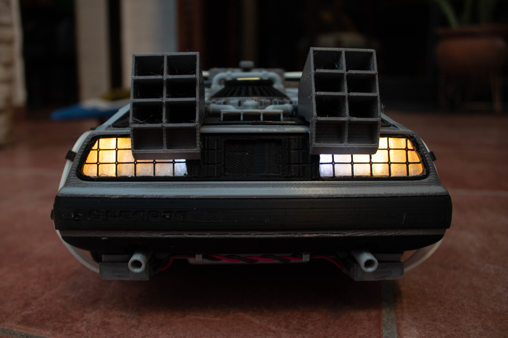
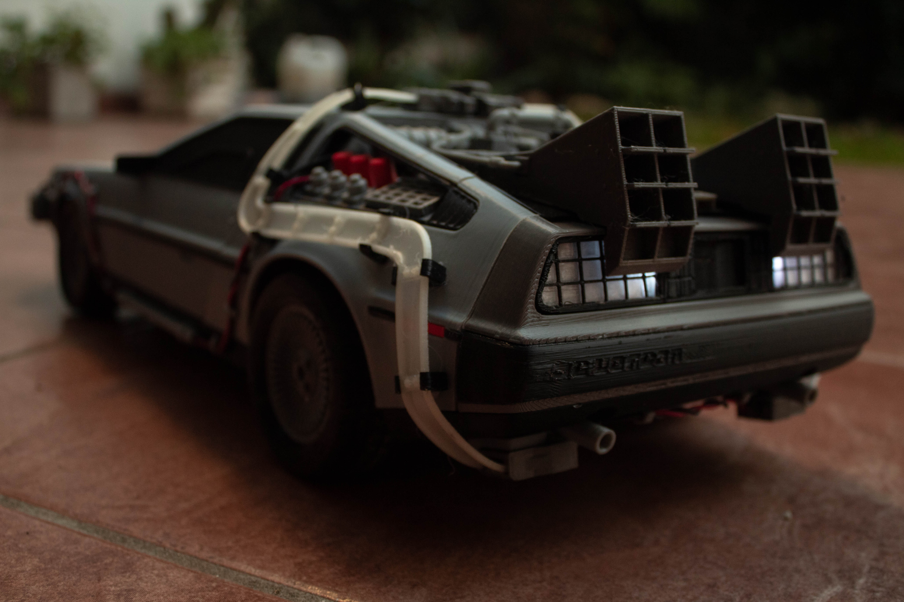
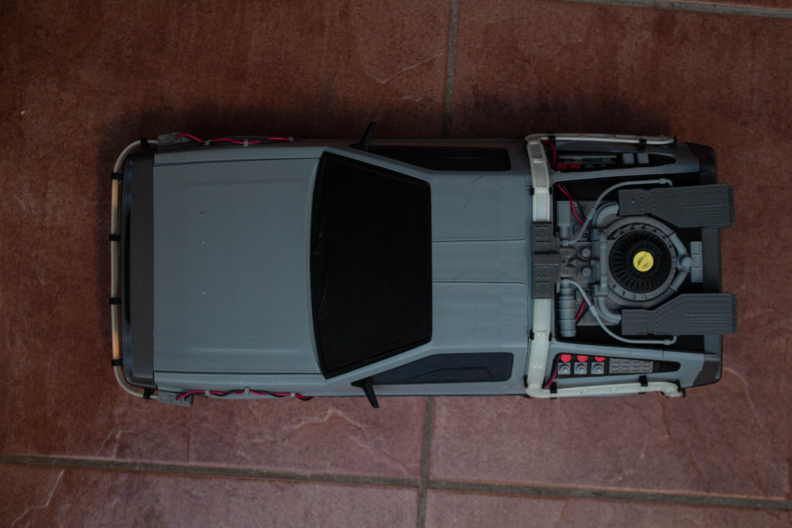
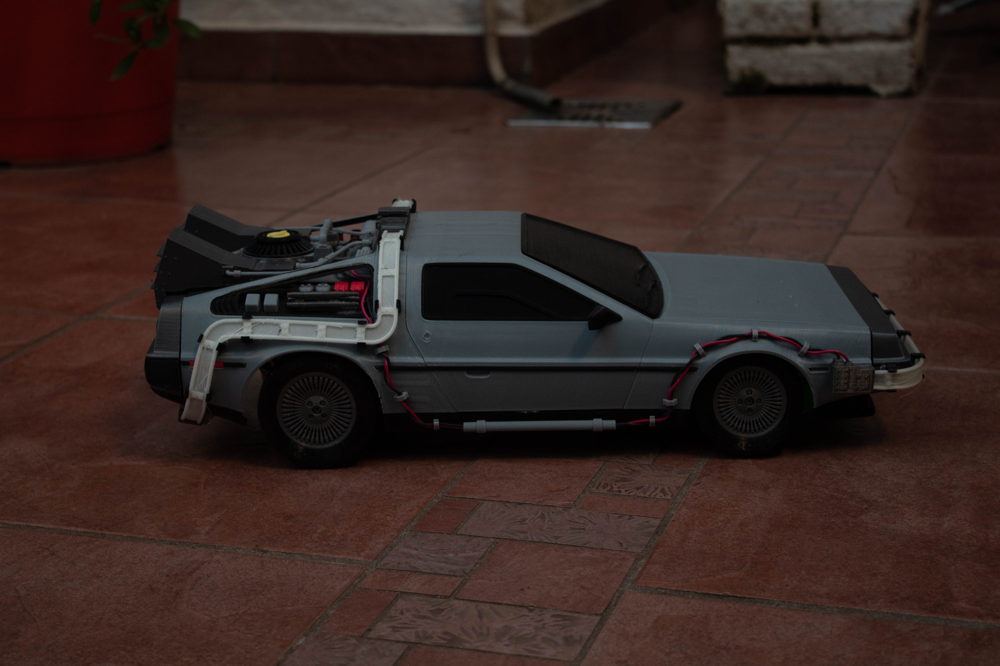
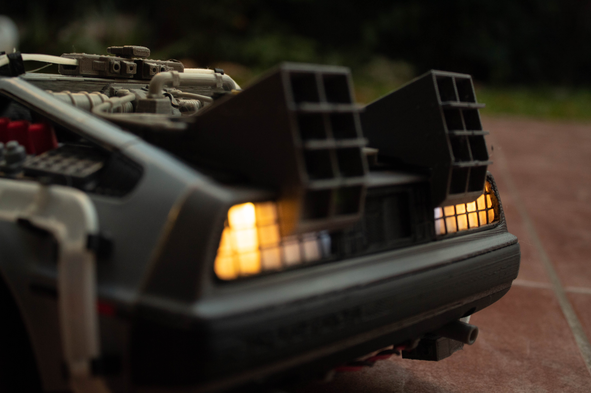
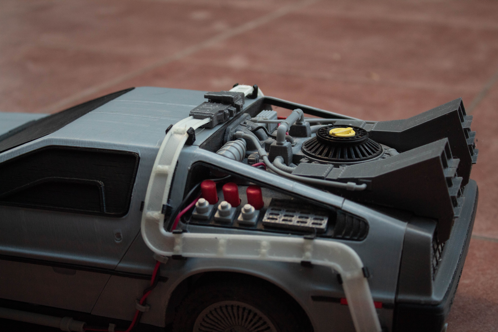
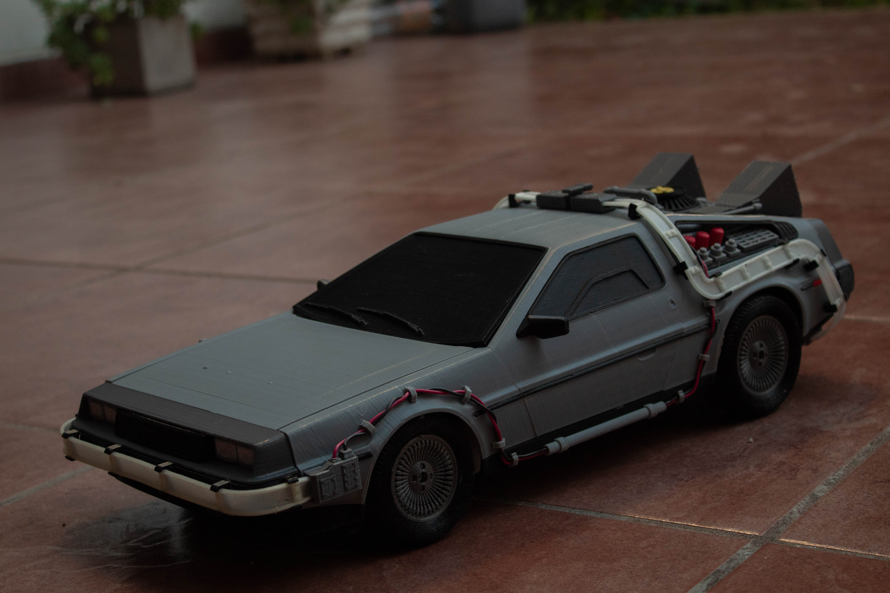
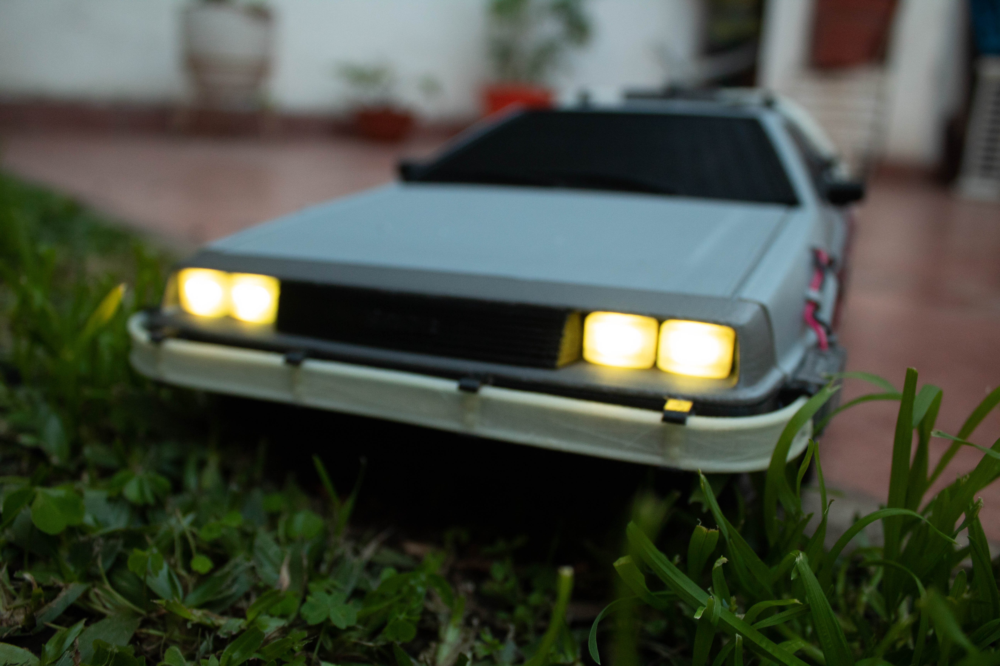
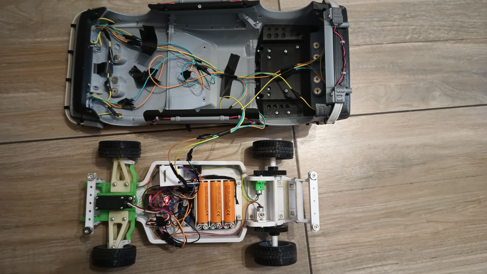

# 🚗 ESP-RC Brain: El Cerebro de Código Abierto para tu Coche RC

¡Te damos la bienvenida al repositorio de ESP-RC Brain! Este proyecto es el corazón de un coche a radiocontrol inteligente, construido sobre un potente microcontrolador ESP32. Aquí encontrarás todo lo necesario para dar vida a tu propio vehículo: el firmware, los modelos 3D y una increíble aplicación web para que tomes el control desde cualquier navegador.

Este no es solo un coche a RC, es una plataforma abierta para que puedas experimentar, aprender y, sobre todo, ¡divertirte a lo grande!

## 🎬 Galería del Proyecto

### Videos

<p align="center">
<a href="https://www.youtube.com/watch?v=_Qa1ab6sNVU">

</a>
<a href="https://www.youtube.com/watch?v=7CDSC2cwirc">

</a>
</p>

### Imágenes

<p align="center">
  
  
</p>
<p align="center">
  
  
</p>
<p align="center">
  
  
</p>
<p align="center">
  
  
</p>
<p align="center">
  
  
</p>

## ✨ Características Principales

-   **Control Total:**
    -   **Bluetooth:** Conecta tu joystick o gamepad Bluetooth favorito y conduce con precisión. (Gracias a la increíble librería [Bluepad32](https://github.com/ricardoquesada/bluepad32)).
    -   **Wi-Fi:** Usa nuestra aplicación web para controlar cada aspecto del coche desde tu teléfono, tablet o PC.

-   **Conectividad Flexible:**
    -   **Modo Access Point (AP):** El coche crea su propia red Wi-Fi para que te conectes directamente.
    -   **Modo Cliente:** Conecta el coche a tu red Wi-Fi existente para mayor comodidad.

-   **Aplicación Web Intuitiva:**
    -   **Dos Estilos de Joystick:** Elige entre un joystick unificado o dos palancas separadas (¡al estilo tanque!).
    -   **Configuración en Tiempo Real:** Ajusta la velocidad máxima, la alineación del servo, los límites de giro y más, ¡todo desde el navegador y al instante!
    -   **Control de Luces LED:** Personaliza las luces de tu coche, define funciones (freno, intermitentes, posición) y crea un estilo único.
    -   **Gestión del Sistema:** Reinicia el ESP32 o restaura la configuración de fábrica con un solo clic.

-   **Firmware Robusto:** Escrito en C++ sobre el framework oficial de Espressif (ESP-IDF), garantizando un rendimiento y estabilidad de nivel profesional.

-   **Fácil de Modificar:** La aplicación web se compila en un único archivo HTML, que se integra directamente en el firmware del ESP32 para un despliegue sencillo.

## 📂 Estructura del Proyecto

Hemos organizado el repositorio de forma lógica para que encuentres todo fácilmente.

```
esprc-brain-c6/
├── Firmware/
│   ├── main/             # Código fuente principal del ESP32 (C++).
│   │   ├── src/          # Archivos .cpp con la lógica de la aplicación.
│   │   └── include/      # Archivos de cabecera .h.
│   │
│   ├── webapp/           # Código fuente de la aplicación web (HTML, CSS, JS).
│   │
│   ├── components/       # Librerías y componentes de ESP-IDF (como Bluepad32).
│   └── build/            # Carpeta de compilación (generada automáticamente).
│
├── Models/               # Modelos 3D para imprimir las piezas del coche.
│   ├── SCADs/            # Archivos fuente de OpenSCAD (modificables).
│   ├── STLs/             # Archivos STL listos para imprimir.
│   └── README.MD         # Instrucciones sobre los modelos 3D.
│
├── README.md             # ¡Estás aquí!
└── LICENSE               # La licencia MIT de este proyecto.
```

## 🔩 Modelos 3D

Todos los modelos 3D utilizados para imprimir el chasis y la carrocería del coche se encuentran en la carpeta `Models`. Dentro de ella, encontrarás instrucciones más detalladas en el archivo `README.MD`.

- **[Ver detalles de los modelos 3D](./Models/README.MD)**

## 🚀 Primeros Pasos

¿Listo para construir? Aquí te explicamos cómo poner todo en marcha.

### Requisitos Previos

1.  **Hardware:** 
    - Un microcontrolador ESP32 (Se puede utilizar un ESP32 o un ESP32-C6).
    - LEDs WS2812 si se quieren usar las luces.
    - Driver de motor DC. Probado con L298N
    - Motor/es DC (para la aceleracion)
    - Motor Servo (para la direccion)
    - Alimentacion:
      - Actualmente estoy usando 3 baterias 18650 conectadas a un protector de bateria. Y un regulador Step-Down para bajar la tension a 5v para el ESP32 y el Motor Servo.
2.  **Software:**
    -   [ESP-IDF](https://docs.espressif.com/projects/esp-idf/en/stable/esp32/get-started/index.html): El entorno de desarrollo de Espressif.
    -   [Node.js y npm](https://nodejs.org/): Para gestionar y compilar la aplicación web. (Solo necesario si se quiere modificar la webapp)
    -   [Git](https://git-scm.com/): Para clonar el repositorio.

### 1. Preparar el Firmware (ESP32)

1.  **Clona el repositorio:**
    Es muy importante usar la opción `--recursive` para descargar también los submódulos necesarios (como Bluepad32).
    ```bash
    git clone --recursive https://gitlab.com/falmon/esprc-brain.git
    cd esprc-brain-c6/Firmware
    ```

2.  **Configura el proyecto:**
    Abre el menú de configuración de ESP-IDF para ajustar parámetros específicos de tu hardware si fuera necesario.
    ```bash
    idf.py menuconfig
    ```

3.  **Compila el firmware:**
    Este comando compilará todo el código C++ y lo preparará para ser transferido al ESP32.
    ```bash
    idf.py build
    ```

4.  **Flashea el ESP32:**
    Conecta tu ESP32 por USB y ejecuta el siguiente comando. Recuerda cambiar `/dev/ttyUSB0` por el puerto serie que corresponda en tu sistema.
    ```bash
    idf.py -p /dev/ttyUSB0 flash monitor
    ```
    Este comando flashea el firmware y abre una consola serie para que veas los mensajes de diagnóstico en tiempo real.

### 2. Desarrollo de la WebApp (Opcional)

Si quieres modificar la interfaz web, sigue estos pasos. La webapp usa **Gulp.js** para empaquetar todo el código (HTML, CSS, JS) en un único archivo que se integra en el firmware.

1.  **Navega a la carpeta de la webapp:**
    ```bash
    cd esprc-brain-c6/Firmware/webapp
    ```

2.  **Instala las dependencias:**
    ```bash
    npm install
    ```

3.  **Comandos útiles:**
    -   `npm run build` o `gulp`: Compila la webapp. Este comando empaqueta y minifica los archivos de `src/` y copia el `index.html` resultante en la carpeta `Firmware/main/`, listo para ser incluido en el firmware.
    -   `npm run serve`: Inicia un servidor local para probar la webapp en tu navegador sin necesidad de flashear el ESP32.
    -   `npm run clean`: Borra los archivos generados por la compilación.

> **Nota:** Después de modificar la webapp y compilarla con `npm run build`, debes volver a compilar y flashear el firmware del ESP32 para que los cambios surtan efecto en el coche.

## 🔧 Guía de Uso

### Primera Conexión

Por defecto, el ESP32 se inicia en **Modo Access Point (AP)**.

1.  **Conéctate a la red Wi-Fi:** En tu teléfono o PC, busca una red Wi-Fi llamada **"ESP-RC-CAR"** y conéctate a ella.
2.  **Abre la interfaz web:** Abre tu navegador y ve a la dirección [http://ecar.local](http://ecar.local) o [http://192.168.4.1](http://192.168.4.1).
3.  **¡A conducir!** Ya estás en la interfaz de control. Desde la pestaña **"Conexión"**, puedes cambiar al modo Cliente para que el coche se conecte a tu red Wi-Fi local.

### Guía Detallada de la Interfaz Web

La aplicación web te da un control granular sobre todas las funciones del coche. Se divide en las siguientes pestañas:

#### 🕹️ Joystick A
Este modo presenta un solo joystick virtual para un control unificado del vehículo.
- **Controles disponibles:**
  - **Ubicación del Joystick:** Puedes cambiar la posición del control en la pantalla para mayor comodidad.
  - **Luces:** Cicla entre los modos de faros (apagado, posición, bajas y altas).
  - **Intermitentes:** Activa las luces de giro izquierda y derecha.
  - **Balizas:** Activa las luces de emergencia.

#### 🕹️🕹️ Joystick B
Este modo ofrece dos joysticks virtuales para un manejo independiente de la aceleración y la dirección, similar a un tanque.
- **Controles disponibles:**
  - **Joystick de Dirección:** Controla el servo de giro.
  - **Joystick de Aceleración:** Controla la velocidad y el sentido de los motores.
  - **Invertir Joysticks:** Intercambia la posición de los joysticks en pantalla.
  - **Controles de Luces:** Idénticos a los del Joystick A (faros, intermitentes, balizas).

#### 📡 Conexión
Aquí puedes configurar todo lo relacionado con la conectividad del ESP32.
- **Direcciones de Red:**
  - **Dirección IP:** Muestra la IP actual del ESP32.
  - **URL de WebSocket:** Dirección para la comunicación en tiempo real (control de movimiento). Puedes cambiarla para desarrollo local sin necesidad de guardar. Requiere pulsar `Reconectar Websocket`.
  - **URL de API:** Dirección para comandos y configuraciones. También se puede cambiar para desarrollo local.
- **Configuración Wi-Fi:**
  - **Modo Wi-Fi:** Elige cómo se conecta el ESP32.
    - **Punto de Acceso (AP):** El ESP32 crea su propia red Wi-Fi. Ideal para uso en exteriores.
    - **Cliente:** El ESP32 se conecta a una red Wi-Fi existente.
- **Acciones:**
  - **Actualizar:** Obtiene la configuración actual desde el ESP32.
  - **Guardar:** Almacena los cambios de configuración en el ESP32.
  - **Reconectar Websocket:** Reinicia la conexión de control en tiempo real.

#### 🚗 Configuración del Auto
En esta sección se ajustan los parámetros físicos del coche.
- **Ajustes de Aceleración:**
  - **Velocidad Máxima:** Limita la potencia máxima de los motores DC.
  - **Velocidad Mínima:** Define la potencia mínima para que los motores empiecen a moverse.
- **Ajustes de Dirección:**
  - **Alineación:** Calibra el punto central del servo de dirección.
  - **Límite Giro Izquierdo:** Establece el ángulo máximo de giro a la izquierda.
  - **Límite Giro Derecho:** Establece el ángulo máximo de giro a la derecha.
- **Bluetooth:**
  - **Habilitar Bluetooth:** Activa el modo de emparejamiento para conectar un nuevo joystick.
  - **¡Atención!** El Bluetooth se deshabilita por defecto al iniciar en modo AP para evitar conflictos.

#### 💡 Configuración LED
Personaliza el sistema de iluminación de tu coche. Se requieren LEDs direccionables (tipo WS2812B).
- **Definición de LEDs:**
  - Primero, especifica la **cantidad total de LEDs** conectados en serie.
  - Luego, crea **grupos de LEDs** asignándoles una función. Puedes definir los LEDs de un grupo con números separados por comas (ej: `0,1,5`) o rangos (ej: `6-9`), o una combinación (ej: `0,6-7,9-10,12`).
- **Funciones de los Grupos:**
  Para cada grupo, puedes definir la función, el color y el brillo.
  - `LUZ POSICION FRONTAL`: Faros delanteros.
  - `LUZ POSICION TRASERA`: Faros traseros.
  - `LUZ DE FRENO`
  - `LUZ DE MARCHA ATRAS`
  - `INTERMITENTE IZQUIERDO`
  - `INTERMITENTE DERECHO`
  - `LUZ INTERIOR`
  - `LUZ BAJOS` (Efecto neón)
- **Comportamiento Actual:**
  - Las luces de posición, interior y bajos se activan con el botón de faros y tienen 3 niveles de intensidad.
  - Los intermitentes se activan tanto al girar como con las balizas.
  - La luz de marcha atrás aún no está implementada.

#### ⚙️ Administración ESP32
Tareas de mantenimiento del microcontrolador.
- **Reiniciar ESP32:** Realiza un reinicio por software.
- **Limpiar Configuración (Hard Reset):** Borra toda la configuración guardada y la restaura a los valores por defecto.

#### 🔧 Ajustes
Configuraciones propias de la aplicación web.
- **Idioma:** Cambia el idioma de la interfaz.
- **Apariencia:** Elige entre el modo claro y el modo oscuro.

## 🤝 ¿Quieres Contribuir?

¡Las contribuciones son el motor del código abierto y son más que bienvenidas! Si tienes una idea, has encontrado un error o quieres añadir una nueva funcionalidad, sigue estos pasos:

1.  Haz un **Fork** de este repositorio.
2.  Crea una nueva rama para tu funcionalidad (`git checkout -b feature/mi-idea-genial`).
3.  Realiza tus cambios y haz commit (`git commit -m 'Añado una nueva idea genial'`).
4.  Sube tu rama a tu fork (`git push origin feature/mi-idea-genial`).
5.  Abre un **Pull Request** para que podamos revisar tu aportación.

## 📝 Tareas Pendientes (ToDo)

-   [ ] Implementar el control automático de luces desde la webapp.
-   [ ] Agregar un esquema del circuito electrónico.
-   [ ] Función para exportar e importar la configuración completa del coche.


## 🙏 Agradecimientos

-   **[Duke Doks](https://dukedoks.com/):** Por crear y compartir los increíbles modelos 3D del [chasis](https://dukedoks.com/portfolio/guia-chasis-rc/) y la [carrocería](https://dukedoks.com/portfolio/guia-delorean-bttf/).
-   **[Ricardo Quesada](https://github.com/ricardoquesada):** Por desarrollar la fantástica librería [Bluepad32](https://github.com/ricardoquesada/bluepad32).
-   **[Benoît Blanchon](https://github.com/bblanchon):** Por la indispensable librería [ArduinoJson](https://github.com/bblanchon/ArduinoJson).

## 📜 Licencia

Este proyecto está distribuido bajo la **Licencia MIT**. Esto significa que eres libre de usar, modificar y distribuir el código como quieras, siempre que mantengas el aviso de copyright original.

> **Importante:** Bluepad32 depende de la librería [BTstack](https://github.com/bluekitchen/btstack), que es gratuita para proyectos de código abierto pero requiere una licencia comercial para proyectos de código cerrado.

---
Hecho con ❤️, ☕ y muchos cables por [Facundo Almon](https://github.com/facundoAlmon).